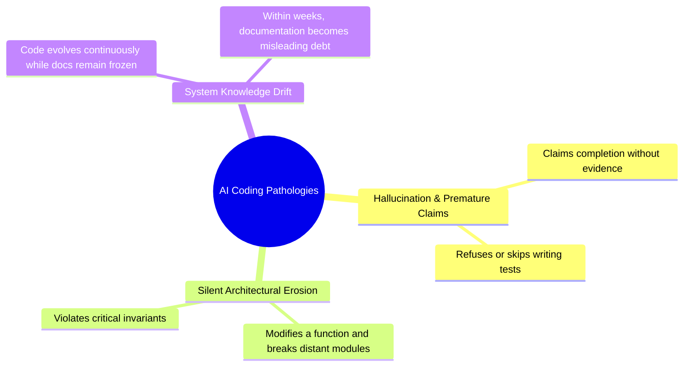
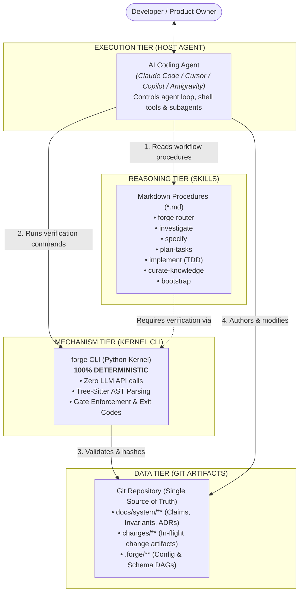

<p align="right">
  <strong>Language:</strong>
  <a href="./README.md"><strong>English</strong></a> |
  <a href="./docs/vi/README.md">Tiếng Việt</a> |
  <a href="./docs/ja/README.md">日本語</a>
</p>

# Forge — Software Engineering Harness for AI Coding Agents

<p align="center">
  <strong>A personal software-engineering harness that makes an AI coding agent behave like a disciplined senior engineer.</strong><br>
  <em>Investigate before modifying • Specify before implementing • Keep system knowledge accurate and mechanically verifiable.</em>
</p>

<p align="center">
  
  
  
  
  
  
</p>

---

## ⚡ 2-Minute Quick Start: From Zero to First Agent Prompt

> **Skip the theory and start using Forge in your project right away with these 5 steps:**

### Step 1: Install Forge CLI
Install `forge` onto your machine globally (via `pip` or `uv` / `pipx`):
```bash
pip install git+https://github.com/CodeGenLabs/forge-harness.git

# Or with uv (recommended):
uv tool install git+https://github.com/CodeGenLabs/forge-harness.git
```
Verify installation:
```bash
forge doctor
```

### Step 2: Initialize Forge in Your Project
Navigate to your project repository (new or existing codebase) and run:
```bash
cd /path/to/my-project
forge init
```

### Step 3: Activate Skills for Your AI Coding Agent
Run the single command matching your agent host:
```bash
forge install --host claude       # For Claude Code (.claude/skills/)
forge install --host antigravity  # For Google Antigravity (.agent/skills/)
forge install --host codex        # For OpenAI Codex / Cursor / ChatGPT (AGENTS.md)
```
*(Recommended)*: Add project operating rules to `CLAUDE.md` (for Claude) or `AGENTS.md` (for Antigravity / Cursor):
```markdown
# Forge Operating Rules
- All code modifications MUST proceed through Forge Harness.
- Begin any task by running `forge status` to inspect active changes and claims.
- Before making changes, open a change via `forge change new "<title>" --track <A|B|C>`.
- Strictly follow TDD: Test first, code second.
- Changes are only complete when `forge verify --change <N>` exits 0.
```

### Step 4: Synchronize & Verify Project Health

> **Order matters.** The derived tier is generated from `HEAD`, so commit what Forge
> scaffolded *before* you sync, then commit the tier on its own. Syncing first produces a
> tier that is stale the moment it is written, and `forge check` will say so.

```bash
# Declare build/test commands in .forge/config.yaml if applicable (e.g. npm test, pytest, dotnet test)
git add -A && git commit -m "chore: adopt forge"

forge sync derived
git add docs/system/derived && git commit -m "chore: sync derived tier"

forge check   # When it prints "ok - no issues", you are 100% ready!
```
*(For existing codebases — Brownfield)*: Run this additional command so Forge automatically maps your modules, languages, and dependencies:
```bash
forge bootstrap derive
```

### Step 5: Send Your First Prompt to the AI Agent!
Open your AI Agent (Claude Code, Antigravity, Cursor...) in your project repository and send the first prompt:

* **Scenario A: Have AI survey and catalog your existing codebase**
  > *"This repository uses Forge harness. Read the `bootstrap` skill and execute Pass 2: survey the codebase and propose candidate claims (architecture, components, invariants, pitfalls) into `docs/system/`."*

* **Scenario B: Start developing a feature or bugfix right away**
  > *"This repository uses Forge harness. Read the `forge` skill, check `forge status`, and open a change via `forge change new \"<feature-name>\" --track B` to implement it with disciplined TDD."*

---

## Table of Contents

1. [2-Minute Quick Start](#-2-minute-quick-start-from-zero-to-first-agent-prompt)
2. [Overview](#-overview)
3. [The Core Problems Forge Solves](#-the-core-problems-forge-solves)
4. [3-Tier Independent Architecture](#-3-tier-independent-architecture)
5. [Breakthrough Technical Mechanisms](#-breakthrough-technical-mechanisms)
6. [Advanced Installation Options](#-advanced-installation-options)
7. [Scenario Guides](#-scenario-guides)
   - [Scenario 1: Adopting an Existing Codebase (Bootstrap)](#scenario-1-adopting-an-existing-codebase-bootstrap)
   - [Scenario 2: Feature Development Lifecycle](#scenario-2-feature-development-lifecycle)
   - [Scenario 3: Monitoring & Managing Drift](#scenario-3-monitoring--managing-drift)
   - [Scenario 4: Integrating with Host AI Agents](#scenario-4-integrating-with-host-ai-agents)
8. [CLI Cheatsheet](#-cli-cheatsheet)
9. [Deep Dive Documentation](#-deep-dive-documentation)

---

## 🌟 Overview

**Forge** is an independent Software Engineering Harness that operates directly inside your git repositories. Working alongside AI Coding Agents (Claude Code, Cursor, Copilot CLI, Antigravity, and others), Forge enforces strict software engineering discipline:

- **Investigate before modifying:** Never alter code without understanding the current system reality and implicit invariants.
- **Specify before implementing:** Define delta requirements and verifiable scenarios before writing a single line of production code.
- **Mechanically Verifiable System Knowledge:** Completely eliminate documentation rot (drift) without expensive, non-deterministic LLM queries.

---

## 🎯 The Core Problems Forge Solves

When pair-programming with AI coding agents on real-world projects, developers inevitably encounter three systemic failure modes:



### Side-by-Side Comparison

| Without Forge | With Forge Harness Supervision |
|---|---|
| **Prompt-based wishes:** Begging AI to "be careful" fails as context windows grow long. | **Deterministic Gates:** Enforced via CLI exit codes (0 = pass, non-zero = blocked). Non-negotiable. |
| **Unbounded code editing:** AI jumps into code immediately, patching symptoms rather than causes. | **Mandatory TDD:** Red-Green-Refactor within declared, verifiable file scopes. |
| **Document rot:** Manual docs are written once and never updated. | **Anchored Claims:** System knowledge is anchored to AST fingerprints. Structural edits trigger immediate drift warnings. |

---

## 🏛️ 3-Tier Independent Architecture

Forge strictly separates responsibilities based on a core truth: **Computers excel at calculation, hashing, and deterministic checks; AI excels at reasoning, synthesis, and code authoring.**



### 3 Inviolable Rules
1. **The Kernel never calls an AI model:** All outputs from `forge` CLI are 100% reproducible from repository commits.
2. **Skills cannot self-enforce:** All blocking originates from kernel exit codes, never from conversational agreement.
3. **All state is plain text in Git:** No proprietary databases, no background daemon, no hidden out-of-sync cache.

---

## ⚡ Breakthrough Technical Mechanisms

### 1. Anchored Claims (AST-Bound Knowledge)
Knowledge units in Forge are structured **Claims** bound directly to Abstract Syntax Tree (AST) nodes in code:

```markdown
### INV-7 — Refunds can never exceed captured amount

```claim
kind: invariant
status: enforced
truth-source: tests
anchors:
  - src/payments/refund.py#compute_refundable@a1b2c3d
evidence:
  - test: tests/test_refund.py::test_refund_cannot_exceed_capture
governs: [CMP-payments]
since: ADR-0014
reviewed: 2026-09-10
```

Partial refunds are cumulative: the sum of settled refunds is the bounded value.
Requests exceeding the remaining balance are rejected at the domain boundary.
```

- **YAML Block:** Machine-readable declaration hashed with Tree-Sitter AST tokens.
- **Markdown Body:** Natural language rationale ("Why") for human and agent reasoning.

---

### 2. The Claim-Touch Rule
When modifying code, Forge computes an exact set intersection:
$$\text{Git Diff of Change} \cap \text{All Anchors in System Knowledge} = \text{Claim-Touch Set}$$

If non-empty, `forge gate impact:post` strictly blocks until `impact.md` explicitly accounts for each touched claim.

---

### 3. 3-Track Scale Router
- **Track A (Probe):** Spikes, feasibility checks, throwaway experiments.
- **Track B (Bounded):** Contained changes in existing flows (spec if logic changes, TDD tasks).
- **Track C (Structural):** Architecture changes, new modules, schema migrations (Full DAG, ADR, rigorous gates).
- **One-way Ratchet:** Complexity can escalate tracks (B ➔ C), never downgrade.

---

## 📦 Advanced Installation Options

### Prerequisites
- **Python >= 3.11** (`python --version`)
- **Git** (`git --version`)

> [!IMPORTANT]
> **Why does the `forge` command sometimes report `not recognized` or `command not found`?**
> * If installed inside a local `.venv` of this repo, `forge` is only known to that specific directory.
> * When switching to another project (e.g. `/path/to/my-project`), the shell cannot locate `forge` unless installed into your global `PATH`.
> * Choose one of the global installation methods below.

---

### Option 1: Global Install via `pipx` or `uv tool` *(Recommended)*

#### 1A. Direct from GitHub *(No local clone required)*
```bash
# Using pipx:
pipx install git+https://github.com/CodeGenLabs/forge-harness.git
pipx ensurepath

# Or using uv (fastest):
uv tool install git+https://github.com/CodeGenLabs/forge-harness.git
```

#### 1B. From cloned repository
```bash
git clone https://github.com/CodeGenLabs/forge-harness.git
cd forge-harness
pipx install .
# or
uv tool install .
```

---

### Option 2: 1-Click Automated Installer Scripts

* **Windows (PowerShell):**
  ```powershell
  git clone https://github.com/CodeGenLabs/forge-harness.git
  cd forge-harness
  powershell -ExecutionPolicy Bypass -File .\scripts\install.ps1
  ```
* **Linux / macOS (Bash):**
  ```bash
  git clone https://github.com/CodeGenLabs/forge-harness.git
  cd forge-harness
  bash ./scripts/install.sh
  ```

Automatically creates an isolated user venv at `~/.forge-harness/venv`, installs shims into `~/.local/bin`, and permanently registers it in your User `PATH`.

---

### Option 3: Developer Local Mode (Editable)
```bash
git clone https://github.com/CodeGenLabs/forge-harness.git
cd forge-harness
python -m venv .venv
.venv\Scripts\activate      # Windows
# source .venv/bin/activate # Linux / macOS
pip install -e ".[grammars,dev]"
```

---

### 💡 Fallback Command (Zero PATH Setup Required)
You can always invoke Forge directly via Python module execution:
```bash
python -m forge.cli doctor
python -m forge.cli init --repo /path/to/my-project
python -m forge.cli check --repo /path/to/my-project
```

---

### 🎯 Adopting Forge on Any Repository

```bash
cd /path/to/my-project

# 1. Initialize Forge scaffold (.forge/ and docs/system/)
forge init

# 2. Install AI host skills:
forge install --host claude       # For Claude Code (.claude/skills/)
forge install --host antigravity  # For Antigravity (.agents/skills/)
forge install --host codex        # For Cursor / Codex (AGENTS.md)

# 3. Configure test & build commands in .forge/config.yaml:
# commands:
#   build: dotnet build (or npm run build, cargo build, etc.)
#   test:  dotnet test  (or npm test, pytest, go test, etc.)

# 4. Synchronize derived tier & scan inventory:
forge sync derived
forge bootstrap derive

# 5. Verify repository health:
forge doctor
forge check
```

---

## 📖 Scenario Guides

### Scenario 1: Adopting an Existing Codebase (Bootstrap)
Follow the 3-Pass Bootstrap process:
1. `forge init`: Scaffold store baseline.
2. `forge bootstrap derive`: Deterministically scan files, languages, tests, modules.
3. Pass 2: Agent drafts candidate claims into `docs/system/`.
4. `forge bootstrap review`: Human reviews candidate claims (rejects by default).
5. `forge bootstrap seal`: Ratify claims and generate Baseline ADR.

---

### Scenario 2: Feature Development Lifecycle
1. `forge change new "order-refunds" --track C`
2. `forge instructions spec --change 1`
3. `forge gate spec:post --change 1`
4. `forge impact --change 1` (fill out `impact.md`)
5. `forge gate impact:post --change 1`
6. Write TDD tasks in `tasks.md`, execute with Red-Green-Refactor.
7. `forge verify --change 1`
8. `forge archive --change 1`

---

### Scenario 3: Monitoring & Managing Drift
- Check entire store: `forge drift --store`
- Check working diff: `forge drift --changed`
- Record into ledger: `forge drift record`
- Verify integrity: `forge check`

---

### Scenario 4: Integrating with Host AI Agents
In your project rules (`AGENTS.md` or `CLAUDE.md`), add:
```markdown
# Forge Operating Rules
- All code modifications MUST proceed through Forge Harness.
- Begin any task by running `forge status` and checking the active phase.
- Always open a change (`forge change new`) and clear mandatory gates.
- Strictly adhere to TDD: Test first, code second.
- Work is only complete when `forge verify --change <N>` exits 0.
```

---

## 🛠️ CLI Cheatsheet

| Command | Description | Exit Code |
|---|---|:---:|
| `forge doctor` | Inspect environment (Python, Git, Tree-Sitter, Test runner) | 0 / 1 |
| `forge status` | 1-screen summary: track, phase, claims, drift, tests | 0 |
| `forge check` | Run 18 store integrity checks (S1–S18) and freshness checks | 0 / 1 |
| `forge init` | Scaffold `.forge/` and `docs/system/` in repository | 0 |
| `forge install --host <host>` | Install skills into host runtime (`claude`, `antigravity`, `codex`, `agents-md`) | 0 |
| `forge hooks install` | Install Git pre-commit hook to prevent drift commits | 0 |
| `forge hooks uninstall` | Uninstall Git pre-commit hook | 0 |
| `forge reconcile --since <ref>` | Reconcile unmanaged commits and open drift ledger entries | 0 / 1 |
| `forge bootstrap derive` | Pass 1: Deterministic scan of tests, modules, languages | 0 |
| `forge bootstrap review` | Pass 3: Interactive review sheet for candidate claims | 0 |
| `forge bootstrap seal` | Seal ratified claims and generate Baseline ADR | 0 |
| `forge sync derived` | Rebuild derived tier (`inventory`, `deps`, `tests`, `trace`) | 0 |
| `forge change new "<name>" --track <A|B|C>` | Open new change branch | 0 / 2 |
| `forge change show <N>` | Display progress and pending DAG artifacts | 0 |
| `forge gate <point> --change <N>` | Execute lifecycle gate (`spec:post`, `impact:post`, etc.) | 0 / 1 |
| `forge impact --change <N>` | Compute blast radius and claim-touch set | 0 |
| `forge verify --change <N>` | Verify 11 conditions (tests, DAG, touch compliance) | 0 / 1 |
| `forge archive --change <N>` | Fold spec deltas into main store and archive change | 0 / 1 |
| `forge drift --store` | Scan entire claim store for stale AST anchors | 0 / 1 |
| `forge drift --changed` | Scan only anchors touched by current git diff | 0 / 1 |
| `forge claim new <kind> [--append]` | Scaffold claim template (invariant, concept, architecture,...) | 0 |
| `forge trace <ID>` | Bidirectional traceability lookup for claim ID | 0 |
| `forge skill list` | List packaged AI agent skills | 0 |

---

## 🗺️ Roadmap

Full reasoning, and what counts as each item's failure, in
**[the roadmap](docs/en/roadmap.md)**. Every item is argued against
[the evidence record](docs/en/evidence.md) rather than a feature wish list.

**Argued from the measurements**

- [ ] **Phase 0 — Use it.** Ten real changes on one real project, with a friction log.
      Everything below is subordinate to this.
- [ ] **R1 — `forge stats`.** Rework rate, failed verifications, drift verdicts, enforcer
      rate. Worthless before Phase 0, so deliberately not started.
- [ ] **R2 — Measure the lifecycle, not the store.** Does specifying first reduce rework?
- [ ] **R3 — Make the claim store optional.** Blocked on R5 — see the roadmap.
- [ ] **R4 — The enforcer rate is the store's real KPI.**

**Argued from use**

- [ ] **R5 — Knowledge that binds the next session.** A close-out step, and a recording
      heuristic computed from blast radius versus diff.
- [x] **R6 — A harsher intake for new projects.**
    - [x] `docs/system/product.md` — product intent, non-goals, deferral list. *Scaffolded
          by `forge init`; deliberately not in the always-loaded budget.*
    - [x] A flow artifact before tasks. *`flow.md`, conditional on track C — a change with
          no screen records the skip rather than paying for one.*
    - [x] Reference parity — every capability of a reference product built or deferred
          with a reason. *In the `specify` skill; deferring is the expected answer.*
- [x] **R7 — A `ui` verification condition.** Runs the project's own Playwright and axe
      suite; Forge renders nothing. *Shipped: `ui` is a condition; declare `commands.ui`,
      or `ui: none` if the project has no browser UI.*
- [x] **R8 — Ban the average, prescribe nothing.** Advisory, never a gate. *Shipped as
      the `interface` skill.*

---

## 📚 Deep Dive Documentation

Visit our full documentation online at **[https://codegenlabs.github.io/forge-harness/](https://codegenlabs.github.io/forge-harness/)** or browse locally:

| Section | Description | English | Tiếng Việt | 日本語 |
| :--- | :--- | :---: | :---: | :---: |
| **Getting Started** | Setup, global install, first run | [Read](docs/en/getting-started.md) | [Đọc](docs/vi/getting-started.md) | [読む](docs/ja/getting-started.md) |
| **Core Concepts** | 3-tier model, claim store, AST anchors | [Read](docs/en/concepts.md) | [Đọc](docs/vi/concepts.md) | [読む](docs/ja/concepts.md) |
| **CLI Reference** | Complete guide for all 11 commands | [Read](docs/en/cli-reference.md) | [Đọc](docs/vi/cli-reference.md) | [読む](docs/ja/cli-reference.md) |
| **Guides & CI/CD** | AI agents, GitHub Actions, monorepos | [Read](docs/en/guides.md) | [Đọc](docs/vi/guides.md) | [読む](docs/ja/guides.md) |
| **Architecture** | Kernel, Tree-sitter AST, hashes | [Read](docs/en/architecture.md) | [Đọc](docs/vi/architecture.md) | [読む](docs/ja/architecture.md) |
| **Configuration** | Full `.forge/config.yaml` schema | [Read](docs/en/configuration.md) | [Đọc](docs/vi/configuration.md) | [読む](docs/ja/configuration.md) |
| **Troubleshooting**| PATH setup, Windows console, gates | [Read](docs/en/troubleshooting.md) | [Đọc](docs/vi/troubleshooting.md) | [読む](docs/ja/troubleshooting.md) |
| **Constitution** | Inviolable engineering principles | [Read](docs/en/constitution.md) | [Đọc](docs/vi/constitution.md) | [読む](docs/ja/constitution.md) |
| **Evidence** | What Forge measured about itself, including the null results | [Read](docs/en/evidence.md) | [Đọc](docs/vi/evidence.md) | [読む](docs/ja/evidence.md) |
| **Roadmap** | What to build next, and what not to | [Read](docs/en/roadmap.md) | [Đọc](docs/vi/roadmap.md) | [読む](docs/ja/roadmap.md) |
