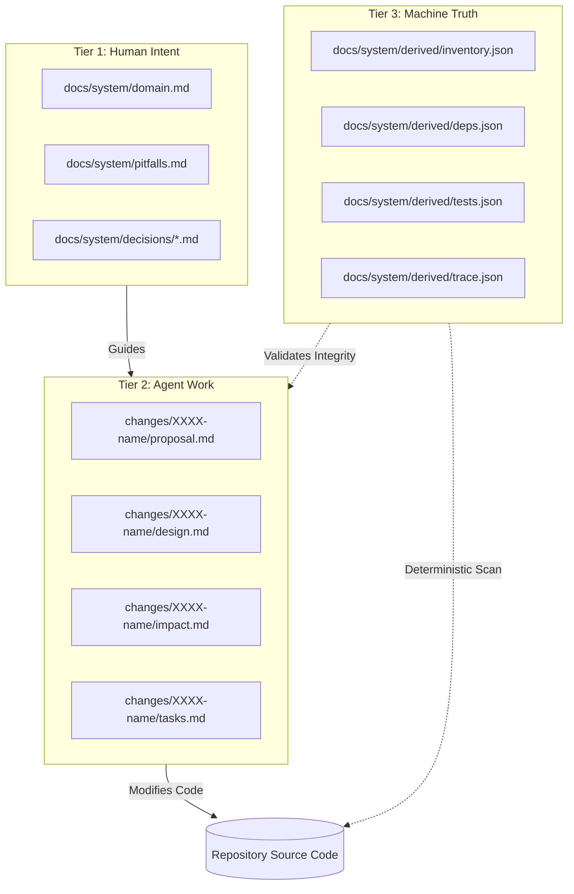
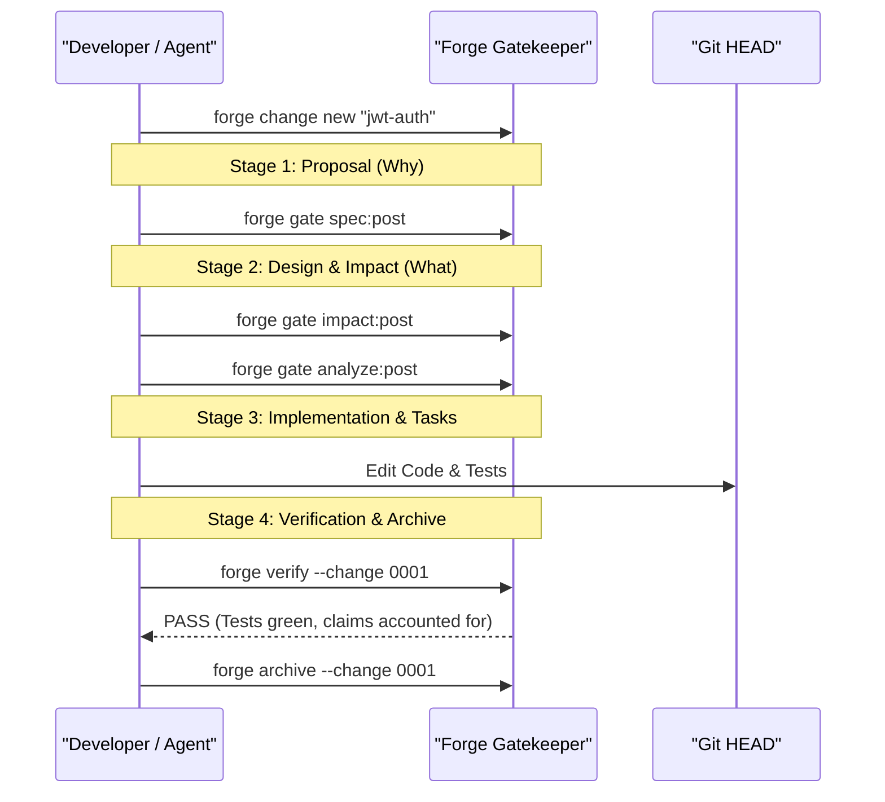

[ 🌐 **English** | [Tiếng Việt](../vi/concepts.md) | [日本語](../ja/concepts.md) ]
---

# Core Concepts

Forge provides deterministic governance over software development through five foundational concepts.

---

## 1. The 3-Tier Architecture

Forge strictly partitions repository knowledge into three distinct tiers:



1. **Human Intent (Tier 1)**: Authored rules and design constraints. Machine cannot overwrite these without human review.
2. **Agent Work (Tier 2)**: Structured change workspaces where agents and developers propose, refine, and verify atomic features.
3. **Machine Truth (Tier 3)**: Auto-generated from git commits. Never authored by hand; regenerated via `forge sync derived`.

---

## 2. Claims & The Claim Store

A **Claim** is a formal, unambiguous statement about the codebase with explicit anchors:

```markdown
### PIT-token-never-logged
Tokens must never appear in unredacted application logs.
<!-- forge:claim
status: ratified
anchors:
  - src/auth/token.py#create_session_token
  - src/logging/formatter.py#RedactingFormatter
-->
```

### Claim Statuses
* `candidate`: Proposed finding under review.
* `ratified`: Actively enforced contract. Breaking this fails CI.
* `retired`: No longer applicable (e.g., deprecated subsystem).

---

## 3. AST Anchors & Fingerprints

Unlike traditional documentation that cites line numbers (which break on the very next commit), Forge binds claims directly to AST nodes:
* `src/core/router.py#Router.dispatch`
* `packages/ui/src/button.tsx#PrimaryButton`
* `internal/storage/sqlite.go#OpenDatabase`

### Fingerprint Resilience
When `src/core/router.py` is modified:
1. Whitespace changes? **Anchor stays fresh.**
2. Comments or docstrings updated? **Anchor stays fresh.**
3. Symbol body modified or renamed? **Anchor is flagged as stale.**
4. Symbol deleted? **Anchor is flagged as missing.**

---

## 4. Change Lifecycle & Gates

Every meaningful change follows a 4-stage lifecycle:



---

## 5. Attributed Drift

When code changes outpace documentation, `forge check` pinpoints:
* Exact commit SHA that caused the divergence
* Author who committed it
* Anchored symbol that changed
* Impacted claim ID
