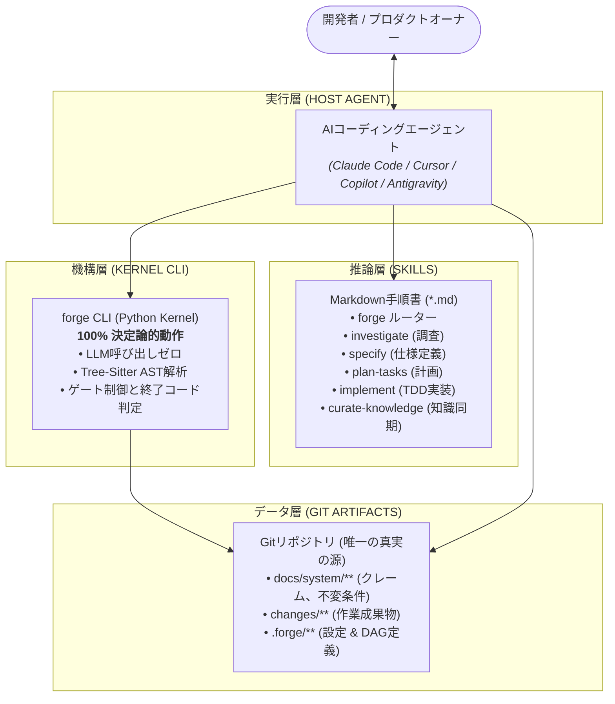

<p align="right">
  <strong>Language:</strong>
  <a href="../../README.md">English</a> |
  <a href="../vi/README.md">Tiếng Việt</a> |
  <a href="../ja/README.md"><strong>日本語</strong></a>
</p>

# Forge — AIコーディングエージェント向けソフトウェアエンジニアリングハーネス

<p align="center">
  <strong>AIコーディングエージェントにシニアエンジニアの規律をもたらす個人用ソフトウェアエンジニアリングハーネス。</strong><br>
  <em>修正前の調査 • 実装前の仕様定義 • 機械的に検証可能なシステム知識の維持</em>
</p>

<p align="center">
  
  
  
  
  
  
</p>

---

## 目次

1. [Forgeの概要](#-forgeの概要)
2. [Forgeが解決する根本的な課題](#-forgeが解決する根本的な課題)
3. [3層独立アーキテクチャ](#-3層独立アーキテクチャ)
4. [画期的な技術メカニズム](#-画期的な技術メカニズム)
5. [グローバルインストールとクイックスタート](#-グローバルインストールとクイックスタート)
6. [シナリオ別ガイド](#-シナリオ別ガイド)
7. [CLIチートシート](#-cliチートシート)
8. [詳細ドキュメント](#-詳細ドキュメント)

---

## 🌟 Forgeの概要

**Forge**は、Gitリポジトリ内で直接動作する独立したソフトウェアエンジニアリングハーネス（制御基盤）です。Claude Code、Cursor、Copilot CLI、AntigravityなどのAIコーディングエージェントと連携し、厳格なエンジニアリング規律を適用します。

- **修正前の調査:** 既存コードの構造や暗黙の不変条件（Invariants）を完全に理解する前にコードを変更することを禁止します。
- **実装前の仕様定義:** 1行目のコードを書く前に、変更要件と検証シナリオを明確に定義します。
- **機械的に検証可能なシステム知識:** 高価で非決定的なLLM呼び出しを一切使わずに、ドキュメントの陳腐化（Drift）を完全に防止します。

---

## 🎯 Forgeが解決する根本的な課題

AIエージェントと共同でコーディングを行う際、開発者は必然的に以下の3つの病弊に直面します。

1. **幻覚と時期尚早な完了主張:** テストを書かずに「完了しました」と宣言する。
2. **構造の暗黙的破壊:** ある関数を変更した結果、遠く離れたモジュールのルールを破壊する。
3. **知識の乖離（System Drift）:** コードが更新されてもドキュメントが更新されず、数週間でドキュメントが負債化する。

---

## 🏛️ 3層独立アーキテクチャ

Forgeは「計算機は決定的な計算と検証に特化し、AIは推論とコード生成に特化する」という原則に基づいています。



### 3つの絶対原則
1. **カーネルはAIモデルを呼び出さない:** すべての計算はリポジトリのコミットから100%再現可能。
2. **スキルは自己強制しない:** 作業の停止はCLIの終了コード（exit code）によってのみ行われる。
3. **すべての状態はGit内のプレーンテキスト:** 独自データベースやバックグラウンドデーモンは一切不使用。

---

## 🚀 グローバルインストールとクイックスタート

### 前提条件
- **Python >= 3.11**
- **Git**

> [!IMPORTANT]
> **「forge コマンドが見つからない」問題の原因と対策:**
> 特定リポジトリ内の `.venv` でインストールした場合、他のディレクトリに移動すると `forge` コマンドが認識されません。
> 全てのリポジトリで自由に呼び出すには、以下のグローバルインストール手順を実行してください。

---

### 方法 1: `pipx` または `uv tool` を使用（最も推奨）

```bash
# pipxを使用する場合 (リポジトリのクローン不要):
pipx install git+https://github.com/CodeGenLabs/forge-harness.git
pipx ensurepath

# または uv を使用する場合 (超高速):
uv tool install git+https://github.com/CodeGenLabs/forge-harness.git
```

---

### 方法 2: 1クリック自動インストーラースクリプト

* **Windows (PowerShell):**
  ```powershell
  git clone https://github.com/CodeGenLabs/forge-harness.git
  cd forge-harness
  powershell -ExecutionPolicy Bypass -File .\scripts\install.ps1
  ```
* **Linux / macOS (Bash):**
  ```bash
  git clone https://github.com/CodeGenLabs/forge-harness.git
  cd forge-harness
  bash ./scripts/install.sh
  ```

ユーザー環境（`~/.forge-harness/venv`）に隔離された環境を作成し、自動的に環境変数 `PATH` に登録します。

---

### 💡 フォールバック呼び出し（PATH設定不要）
```bash
python -m forge.cli doctor
python -m forge.cli init --repo /path/to/my-project
python -m forge.cli check --repo /path/to/my-project
```

---

### 🎯 任意のリポジトリにForgeを適用する手順

```bash
cd /path/to/my-project

# 1. Forge構造の初期化
forge init

# 2. AIエージェント向けスキルのインストール:
forge install --host claude       # Claude Code向け (.claude/skills/)
forge install --host antigravity  # Antigravity向け (.agents/skills/)
forge install --host codex        # Cursor / Codex向け (AGENTS.md)

# 3. .forge/config.yaml にビルド/テストコマンドを設定

# 4. 足場を先にコミットする（派生層は HEAD から生成されるため、順序が重要）:
git add -A && git commit -m "chore: adopt forge"

# 5. 派生層の同期とインベントリスキャン（同期後、派生層のみを単独でコミット）:
forge sync derived
git add docs/system/derived && git commit -m "chore: sync derived tier"
forge bootstrap derive

# 6. リポジトリ健全性の検証:
forge doctor
forge check
```

---

## 🛠️ CLIチートシート

| コマンド | 説明 | 終了コード |
|---|---|:---:|
| `forge doctor` | 実行環境の検証（Python, Git, Grammars, テストランナー） | 0 / 1 |
| `forge status` | システム、クレーム、テスト状況の1画面サマリー | 0 |
| `forge check` | 18項目の整合性検証（S1〜S18）の実行 | 0 / 1 |
| `forge init` | `.forge/` および `docs/system/` の初期化 | 0 |
| `forge install --host <host>` | ホスト環境へのスキル配置 (`claude`, `antigravity`, `codex`) | 0 |
| `forge hooks install` | コミット時のドリフト検出用Gitフックの登録 | 0 |
| `forge hooks uninstall` | Gitフックの解除 | 0 |
| `forge reconcile --since <ref>` | 管理外コミットの照合とドリフト台帳の記録 | 0 / 1 |
| `forge bootstrap derive` | Pass 1: コードベースの機械的スキャン | 0 |
| `forge bootstrap review` | Pass 3: 候補クレームの対話型レビューシート | 0 |
| `forge bootstrap seal` | 承認クレームの確定とベースラインADRの生成 | 0 |
| `forge sync derived` | 派生層（`inventory`, `deps`, `tests`, `trace`）の再生成 | 0 |
| `forge change new "<name>" --track <A|B|C>` | 新規変更ブランチの作成 | 0 / 2 |
| `forge change show <N>` | 変更の進捗状況と未完了成果物の表示 | 0 |
| `forge gate <point> --change <N>` | ライフサイクルゲートの実行 | 0 / 1 |
| `forge impact --change <N>` | 影響範囲と接触クレームの計算 | 0 |
| `forge verify --change <N>` | 11項目の客観的条件（テスト通過等）の検証 | 0 / 1 |
| `forge archive --change <N>` | 仕様デルタを本流へ統合しアーカイブ | 0 / 1 |
| `forge drift --store` | クレームストア全体の陳腐化スキャン | 0 / 1 |
| `forge drift --changed` | 変更差分に関わるアンカーのみをスキャン | 0 / 1 |
| `forge claim new <kind> [--append]` | 新規クレームテンプレートの生成 | 0 |
| `forge trace <ID>` | クレームIDの双方向トレーサビリティ検索 | 0 |
| `forge skill list` | 利用可能なAIスキルの表示 | 0 |

---

## 🗺️ ロードマップ

全体の論拠と、各項目の「何をもって失敗とするか」は
**[ロードマップ](roadmap.md)**に記載。各項目は機能の願望リストではなく
[エビデンス記録](evidence.md)に照らして正当化されている。

**測定から論じたもの**

- [ ] **フェーズ 0 — 使うこと。** 実プロジェクト 1 つで実変更 10 件、摩擦ログ付き。
      以下すべてはこれに従属する。
- [ ] **R1 — `forge stats`。** 手戻り率、verify 失敗回数、ドリフト評決、強制率。
      フェーズ 0 の前では無価値なので意図的に未着手。
- [ ] **R2 — ストアではなくライフサイクルを測る。** 仕様を先に書くと手戻りは減るか。
- [ ] **R3 — クレームストアを任意にする。** R5 待ち（理由はロードマップ参照）。
- [ ] **R4 — 強制率がストアの真の KPI。**

**実使用から論じたもの**

- [ ] **R5 — 次のセッションを拘束する知識。** 締めの一手と、波及範囲対 diff から計算する
      記録判定。
- [x] **R6 — 新規プロジェクトの受け入れを厳しくする。**
    - [x] `docs/system/product.md` — 製品意図・非目標・先送りリスト。*`forge init` が生成。
          常時ロード予算には意図的に含めない。*
    - [x] タスクの前にフロー成果物。*`flow.md`、トラック C で条件付き——画面を変えない変更は
          スキップを記録すればよい。*
    - [x] 参照パリティ — 参照製品の各能力を実装するか理由付きで先送りする。*`specify`
          スキルに追加。先送りが想定される回答である。*
- [x] **R7 — `ui` 検証条件。** プロジェクト自身の Playwright と axe を実行。Forge は
      何もレンダリングしない。*出荷済み：`commands.ui` を宣言する。ブラウザ UI が無ければ
      `ui: none`。*
- [x] **R8 — 平均を禁じ、何も指定しない。** 助言であり、ゲートにはしない。
      *`interface` スキルとして出荷済み。*

---

## 📚 詳細ドキュメント

各分野の詳細な仕様とガイドライン：

| セクション | 概要 | リンク |
| :--- | :--- | :---: |
| **クイックスタート** | インストール、環境確認、初期設定 | [読む](getting-started.md) |
| **コアコンセプト** | 3層モデル、クレームストア、ASTアンカー | [読む](concepts.md) |
| **CLIリファレンス** | 全11コマンドの詳細仕様 | [読む](cli-reference.md) |
| **ガイドとCI/CD** | AIエージェント連携、GitHub Actions、モノレポ | [読む](guides.md) |
| **アーキテクチャ** | カーネル、Tree-sitter AST、ハッシュ検証 | [読む](architecture.md) |
| **設定リファレンス** | `.forge/config.yaml` の完全なスキーマ | [読む](configuration.md) |
| **トラブルシューティング**| PATH設定、Windowsコンソール、ゲートエラー | [読む](troubleshooting.md) |
| **設計憲法** | 16の変更不可エンジニアリング原則 | [読む](constitution.md) |
