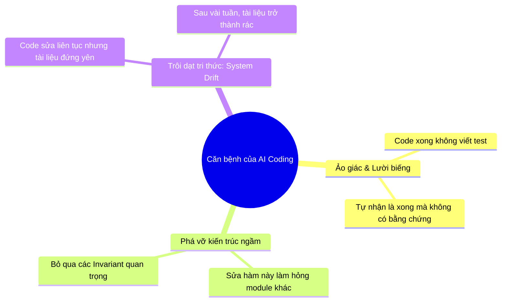
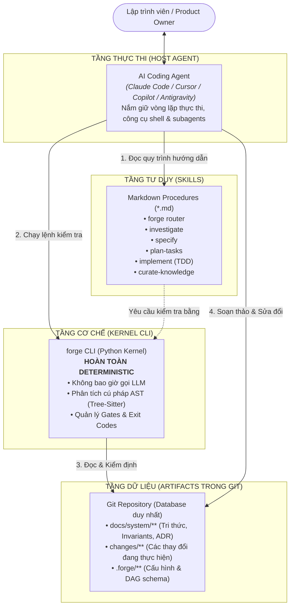
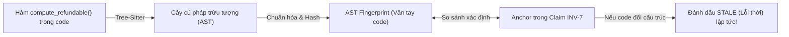
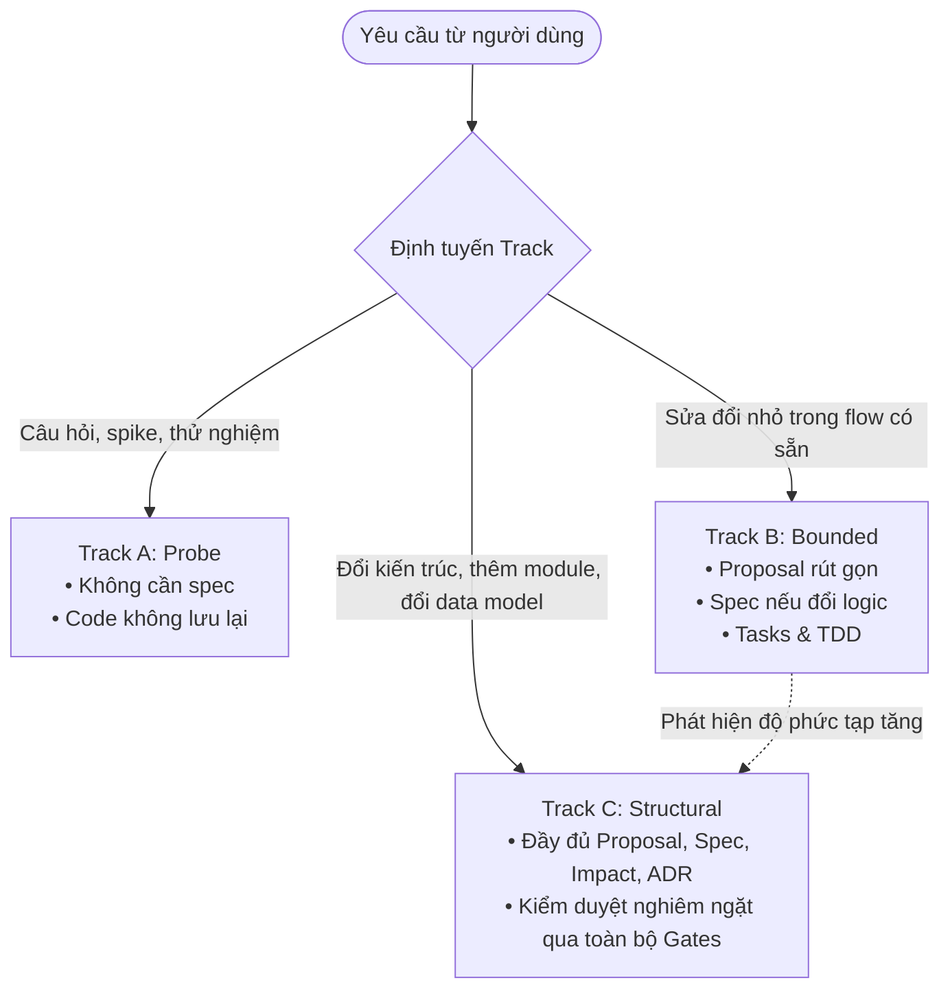
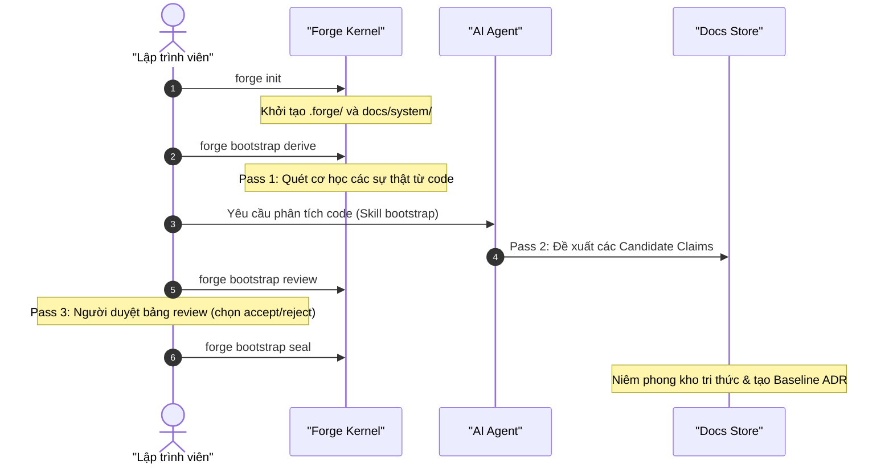

<p align="right">
  <strong>Language:</strong>
  <a href="../../README.md">English</a> |
  <a href="./README.md"><strong>Tiếng Việt</strong></a> |
  <a href="../ja/README.md">日本語</a>
</p>

# Forge — Software Engineering Harness cho AI Coding Agent

<p align="center">
  <strong>Bộ khung kỹ nghệ phần mềm cá nhân giúp AI Coding Agent hành xử như một Kỹ sư Senior kỷ luật.</strong><br>
  <em>Khảo sát trước khi sửa • Đặc tả trước khi code • Giữ tri thức hệ thống luôn chính xác và có thể kiểm chứng cơ học.</em>
</p>

<p align="center">
  
  
  
  
  
  
</p>

---

## ⚡ Bắt đầu nhanh trong 2 phút (Quick Start: From Zero to First Prompt)

> **Bỏ qua lý thuyết dông dài — làm theo 5 bước thực chiến dưới đây để tải về, khởi tạo dự án và ra lệnh cho AI Agent của bạn ngay lập tức:**

### Bước 1: Cài đặt Forge CLI
Cài đặt `forge` vào máy tính (khuyến nghị dùng `pip` hoặc `uv` / `pipx`):
```bash
pip install git+https://github.com/CodeGenLabs/forge-harness.git

# Hoặc dùng uv (cực nhanh):
uv tool install git+https://github.com/CodeGenLabs/forge-harness.git
```
Kiểm tra cài đặt:
```bash
forge doctor
```

### Bước 2: Khởi tạo Forge trong dự án của bạn
Chuyển vào thư mục dự án của bạn (dự án mới hoặc đã có code) và khởi tạo:
```bash
cd /path/to/my-project
forge init
```

### Bước 3: Kích hoạt Skills cho AI Coding Agent bạn dùng
Chạy 1 lệnh tương ứng với AI Coding Agent mà bạn sử dụng:
```bash
forge install --host claude       # Dành cho Claude Code (.claude/skills/)
forge install --host antigravity  # Dành cho Google Antigravity (.agent/skills/)
forge install --host codex        # Dành cho OpenAI Codex / Cursor / ChatGPT (AGENTS.md)
```
*(Khuyến nghị)*: Thêm các quy tắc điều hành vào file `CLAUDE.md` (nếu dùng Claude) hoặc `AGENTS.md` (nếu dùng Antigravity / Codex / Cursor):
```markdown
# Forge Operating Rules
- All code modifications MUST proceed through Forge Harness.
- Begin any task by running `forge status` to inspect active changes and claims.
- Before making changes, open a change via `forge change new "<title>" --track <A|B|C>`.
- Strictly follow TDD: Test first, code second.
- Changes are only complete when `forge verify --change <N>` exits 0.
```

### Bước 4: Đồng bộ dữ liệu & Kiểm tra dự án

> **Thứ tự quan trọng.** Tầng phái sinh được sinh ra từ `HEAD`, nên hãy commit những gì
> Forge vừa tạo *trước khi* sync, rồi commit tầng phái sinh thành một commit riêng. Sync
> trước sẽ tạo ra tầng phái sinh lạc hậu ngay khi vừa ghi, và `forge check` sẽ báo lỗi.

```bash
# Khai báo lệnh build/test trong .forge/config.yaml nếu có (ví dụ: npm test, pytest, dotnet test)
git add -A && git commit -m "chore: adopt forge"

forge sync derived
git add docs/system/derived && git commit -m "chore: sync derived tier"

forge check   # Màn hình hiện "ok - no issues" là sẵn sàng 100%!
```
*(Nếu là dự án đã có sẵn code — Brownfield)*: Chạy thêm lệnh sau để Forge tự động quét và lập bản đồ các module, ngôn ngữ, packages:
```bash
forge bootstrap derive
```

### Bước 5: Ra lệnh đầu tiên cho AI Agent của bạn!
Mở AI Agent (Claude Code, Antigravity, Cursor...) trong thư mục dự án và gửi câu prompt đầu tiên:

* **Kịch bản A: Nếu muốn AI khảo sát và lập hồ sơ toàn bộ dự án hiện có**
  > *"Dự án này sử dụng Forge harness. Hãy đọc skill `bootstrap` và thực hiện Pass 2: Khảo sát codebase để đề xuất các candidate claims (kiến trúc, components, nghiệp vụ, cạm bẫy pitfalls) vào `docs/system/`."*

* **Kịch bản B: Nếu muốn bắt tay vào code tính năng mới hoặc sửa lỗi ngay**
  > *"Dự án này sử dụng Forge harness. Hãy dùng skill `forge`, chạy `forge status`, và mở một change mới bằng lệnh `forge change new \"<tên-tính-năng>\" --track B` để triển khai theo chuẩn TDD."*

---

## Mục lục

1. [Bắt đầu nhanh trong 2 phút](#-bắt-đầu-nhanh-trong-2-phút-quick-start-from-zero-to-first-prompt)
2. [Tổng quan về Forge](#-tổng-quan-về-forge)
3. [Vấn đề cốt lõi mà Forge giải quyết](#-vấn-đề-cốt-lõi-mà-forge-giải-quyết)
4. [Kiến trúc 3 tầng độc lập](#-kiến-trúc-3-tầng-độc-lập)
5. [Các cơ chế kỹ thuật đột phá](#-các-cơ-chế-kỹ-thuật-đột-phá)
6. [Các phương thức cài đặt chuyên sâu](#-các-phương-thức-cài-đặt-chuyên-sâu)
7. [Cẩm nang sử dụng theo kịch bản](#-cẩm-nang-sử-dụng-theo-kịch-bản)
   - [Kịch bản 1: Tiếp quản một dự án có sẵn (Bootstrap)](#kịch-bản-1-tiếp-quản-một-dự-án-có-sẵn-bootstrap)
   - [Kịch bản 2: Vòng đời phát triển tính năng (Change Lifecycle)](#kịch-bản-2-vòng-đời-phát-triển-tính-năng-change-lifecycle)
   - [Kịch bản 3: Giám sát & Quản lý độ lệch tri thức (Drift Management)](#kịch-bản-3-giám-sát--quản-lý-độ-lệch-tri-thức-drift-management)
   - [Kịch bản 4: Tích hợp với AI Coding Agent](#kịch-bản-4-tích-hợp-với-ai-coding-agent)
8. [Bảng tra cứu lệnh CLI (Cheatsheet)](#-bảng-tra-cứu-lệnh-cli-cheatsheet)
9. [Cổng tài liệu chuyên sâu](#-cổng-tài-liệu-chuyên-sâu)

---

## 🌟 Tổng quan về Forge

**Forge** là một bộ khung kiểm soát kỹ nghệ phần mềm (Software Engineering Harness) độc lập, hoạt động trực tiếp trong repository của bạn. Forge phối hợp cùng các AI Coding Agent (Claude Code, Cursor, Copilot CLI, Antigravity,...) để thiết lập một kỷ luật phát triển phần mềm chặt chẽ:

- **Điều tra trước khi sửa:** Không bao giờ sửa code khi chưa nắm rõ hiện trạng và các quy tắc ngầm của hệ thống.
- **Đặc tả trước khi code:** Mọi thay đổi logic đều phải được định nghĩa bằng các yêu cầu và kịch bản có thể kiểm thử trước khi gõ dòng code đầu tiên.
- **Tri thức hệ thống có thể kiểm chứng cơ học (Verifiable System Knowledge):** Giải quyết dứt điểm vấn đề tài liệu bị lỗi thời (drift) so với code mà không cần tốn chi phí gọi LLM để rà soát.

---

## 🎯 Vấn đề cốt lõi mà Forge giải quyết

Khi lập trình cùng các AI Coding Agent trong các dự án thực tế, các lập trình viên thường gặp phải ba "căn bệnh" kinh niên:



### So sánh đối đầu

| Khi không có Forge | Khi có Forge Harness giám sát |
|---|---|
| **Dựa dẫm vào Prompt:** Nhắc AI "Hãy cẩn thận", nhưng AI vẫn bỏ qua hoặc quên luật khi context quá dài. | **Cổng kiểm soát xác định (Deterministic Gates):** Kiểm tra bằng exit code của máy tính. Không đạt chuẩn là chặn đứng, không thể thương lượng. |
| **Sửa code tự do:** Nhảy vào gõ code ngay, sửa triệu chứng thay vì giải quyết nguyên nhân gốc rễ. | **Bắt buộc TDD:** Viết test đỏ trước, viết code xanh sau, tuân thủ phạm vi file đã khai báo. |
| **Tài liệu mục rữa:** Tài liệu viết ra một lần rồi không ai cập nhật, code đi một đằng tài liệu đi một nẻo. | **Khẳng định có neo (Anchored Claims):** Tri thức được neo vào cây cú pháp (AST) của code. Code đổi là hệ thống lập tức phát hiện. |

---

## 🏛️ Kiến trúc 3 tầng độc lập

Forge được thiết kế với sự phân định rạch ròi về mặt trách nhiệm, tuân thủ nguyên tắc: **Máy tính làm việc máy tính giỏi nhất (tính toán, so khớp, kiểm tra exit code), AI làm việc AI giỏi nhất (đọc hiểu nghiệp vụ, lập luận, viết code).**



### 3 Nguyên tắc bất di bất dịch (Inviolable Rules)
1. **Kernel không bao giờ gọi mô hình AI:** Mọi kết quả từ `forge` CLI đều có thể tái lập 100% từ commit của repository.
2. **Skill không có quyền tự cưỡng chế:** Mọi sự ngăn chặn đều phải xuất phát từ exit code của lệnh Kernel CLI.
3. **Mọi trạng thái đều là văn bản trong Git:** Không dùng database riêng, không daemon chạy ngầm, không cache ngầm gây lệch pha.

---

## ⚡ Các cơ chế kỹ thuật đột phá

### 1. Anchored Claim (Khẳng định có neo AST)
Một đơn vị tri thức trong Forge không phải văn xuôi chung chung, mà là một **Claim có cấu trúc** được neo trực tiếp vào cây cú pháp của mã nguồn:

```markdown
### INV-7 — Khoản hoàn tiền không bao giờ vượt quá số tiền đã thu

```claim
kind: invariant
status: enforced
truth-source: tests
anchors:
  - src/payments/refund.py#compute_refundable@a1b2c3d
evidence:
  - test: tests/test_refund.py::test_refund_cannot_exceed_capture
governs: [CMP-payments]
since: ADR-0014
reviewed: 2026-09-10
```

Khoản hoàn tiền một phần có tính tích lũy: tổng các lần hoàn tiền đã quyết toán
mới là giá trị bị giới hạn. Yêu cầu vượt quá số dư sẽ bị từ chối tại ranh giới domain.
```

- **Phần code block:** Dành cho Kernel CLI tính toán AST fingerprint bằng `tree-sitter`.
- **Phần văn bản phía dưới:** Giải thích lý do ("Why") cho AI và con người hiểu.



---

### 2. Quy tắc Claim-Touch (Claim-Touch Rule)
Khi một lập trình viên hoặc AI sửa code, câu hỏi lớn nhất là: *"Những tài liệu và quy tắc nào bị ảnh hưởng cần phải cập nhật?"*

Thay vì để AI tự đoán, Forge biến việc này thành một **phép toán tập hợp cơ học**:
$$\text{Diff Git của Change} \cap \text{Danh sách Anchors của toàn bộ Claims} = \text{Tập Claims bị chạm}$$

Nếu tập này khác rỗng, lệnh `forge gate impact:post` sẽ **chặn đứng** quá trình làm việc cho đến khi file `impact.md` giải trình đầy đủ từng quy tắc bị chạm (là `unaffected`, `updated` hay `superseded`).

---

### 3. Bộ định tuyến 3 Track (Scale Router)
Không phải công việc nào cũng cần thủ tục nặng nề như nhau. Forge phân chia 3 Track linh hoạt:


*Lưu ý: Cơ chế chuyển Track là **bánh cóc một chiều (one-way ratchet)**: chỉ có nâng hạng lên Track nặng hơn khi phát hiện phức tạp ngầm, không có hạ hạng.*

---

## 📦 Các phương thức cài đặt chuyên sâu (Advanced Installation Options)

### Yêu cầu tiên quyết
- **Python >= 3.11** (Kiểm tra bằng: `python --version`)
- **Git** (Kiểm tra bằng: `git --version`)

> [!IMPORTANT]
> **Vấn đề kinh điển: Tại sao lệnh `forge` thường bị báo lỗi `command not found` / `not recognized`?**
> * Khi bạn chỉ tạo môi trường ảo `.venv` bên trong repository này, lệnh `forge` chỉ tồn tại khi terminal đang kích hoạt môi trường ảo đó.
> * Khi bạn chuyển sang repository khác (ví dụ: `D:\git\my-app` hay `D:\git\sample-ecommerce`), terminal ở đó **không hề biết** đến `.venv` của Forge nếu chưa được cài vào biến môi trường `PATH` toàn cục.
> * Để sử dụng `forge` ở **bất kỳ đâu trên máy tính**, hãy chọn một trong các cách cài đặt toàn cục dưới đây.

---

### Cách 1: Cài đặt toàn cục qua `pipx` hoặc `uv tool` *(Khuyên dùng hàng đầu)*

`pipx` và `uv tool` là công cụ chuẩn mực của hệ sinh thái Python hiện đại, giúp cài đặt CLI tools vào môi trường cô lập và tự động tạo shim vào thư mục `PATH` của hệ điều hành.

#### Lựa chọn 1A: Cài trực tiếp từ GitHub *(Không cần clone mã nguồn)*
```bash
# Sử dụng pipx:
pipx install git+https://github.com/CodeGenLabs/forge-harness.git
pipx ensurepath

# Hoặc sử dụng uv (cực nhanh, khuyến nghị):
uv tool install git+https://github.com/CodeGenLabs/forge-harness.git
```

#### Lựa chọn 1B: Cài đặt sau khi đã clone mã nguồn về máy
```bash
git clone https://github.com/CodeGenLabs/forge-harness.git
cd forge-harness

# Dùng pipx:
pipx install .

# Hoặc dùng uv:
uv tool install .
```
*(Sau khi cài xong, bạn có thể mở bất kỳ terminal nào và gõ lệnh `forge` ngay lập tức).*

---

### Cách 2: Sử dụng Script cài đặt tự động 1-Click (`install.ps1` / `install.sh`)

Nếu bạn đã clone mã nguồn về máy và muốn một giải pháp "chạy là xong" mà không cần cài thêm `pipx`:

* **Trên Windows (PowerShell):**
  ```powershell
  git clone https://github.com/CodeGenLabs/forge-harness.git
  cd forge-harness
  powershell -ExecutionPolicy Bypass -File .\scripts\install.ps1
  ```
* **Trên Linux / macOS (Bash):**
  ```bash
  git clone https://github.com/CodeGenLabs/forge-harness.git
  cd forge-harness
  bash ./scripts/install.sh
  ```

**Cơ chế hoạt động của script:**
1. Tự động kiểm tra phiên bản Python >= 3.11.
2. Thiết lập một môi trường ảo dùng riêng biệt tại `%USERPROFILE%\.forge-harness\venv` (không bao giờ bị mất khi bạn đổi folder).
3. Tạo file thực thi shim (`forge.cmd`, `forge.ps1` hoặc `forge`) đặt vào thư mục `~/.local/bin`.
4. Tự động ghi nhận `~/.local/bin` vào biến môi trường **User PATH** vĩnh viễn nếu chưa có.
5. Chạy kiểm chứng `forge doctor` xác nhận thành công ngay tại chỗ.

---

### Cách 3: Cài đặt cho Nhà phát triển Forge (Local Editable Mode)

Dành cho những người muốn trực tiếp chỉnh sửa mã nguồn của chính Forge Harness:

```bash
git clone https://github.com/CodeGenLabs/forge-harness.git
cd forge-harness

# Tạo và kích hoạt môi trường ảo nội bộ
python -m venv .venv
.venv\Scripts\activate      # Trên Windows
# source .venv/bin/activate # Trên Linux / macOS

# Cài đặt dạng editable kèm bộ ngữ pháp AST và công cụ test
pip install -e ".[grammars,dev]"
```

---

### 💡 Lệnh dự phòng (Fallback Command — Chạy mọi nơi không lo lỗi PATH)

Nếu trên máy tính của bạn hoặc đồng nghiệp có cấu hình hạn chế quyền thêm PATH, bạn luôn có thể gọi trực tiếp module Python ở bất kỳ đâu:

```bash
# Thay vì gõ "forge doctor", bạn chạy:
python -m forge.cli doctor

# Thực thi lệnh trên một repo khác qua cờ --repo:
python -m forge.cli init --repo D:\git\my-project
python -m forge.cli doctor --repo D:\git\my-project
python -m forge.cli check --repo D:\git\my-project
```

---

### 🎯 Hướng dẫn: Áp dụng Forge vào một Repository bất kỳ (`my-project`)

Sau khi đã cài đặt `forge` toàn cục, để áp dụng quy trình kiểm soát của Forge vào một dự án mới:

```bash
# 1. Chuyển vào thư mục dự án của bạn
cd /path/to/my-project

# 2. Khởi tạo cấu trúc Forge (.forge/ và docs/system/)
forge init

# 3. Cài đặt kỹ năng điều hướng cho Host AI Agent mà bạn sử dụng:
forge install --host claude       # Nếu dùng Claude Code (chép vào .claude/skills/)
forge install --host antigravity  # Nếu dùng Antigravity (chép vào .agents/skills/)
forge install --host codex        # Nếu dùng Cursor / Codex (chèn marker vào AGENTS.md)

# 4. Khai báo lệnh build và test trong .forge/config.yaml:
# commands:
#   build: dotnet build src/Solution.slnx   (hoặc npm run build, cargo build,...)
#   test:  dotnet test                      (hoặc npm test, pytest, go test,...)

# 5. Đồng bộ tầng phái sinh và quét hiện trạng codebase:
forge sync derived
forge bootstrap derive

# 6. Kiểm tra toàn diện sức khỏe dự án:
forge doctor
forge check
```


---

## 📖 Cẩm nang sử dụng theo kịch bản

### Kịch bản 1: Tiếp quản một dự án có sẵn (Bootstrap)
Khi bạn muốn đưa một codebase đang có vào sự kiểm soát của Forge theo quy trình 3 bước (3-Pass Bootstrap):



---

### Kịch bản 2: Vòng đời phát triển tính năng (Change Lifecycle)
Đây là quy trình làm việc chuẩn mực hàng ngày khi xây dựng một tính năng mới:

#### Bước 1: Mở một Change mới
```bash
forge change new "hoan-tien-don-hang" --track C
```
*Hệ thống sẽ tạo thư mục độc lập: `changes/0002-hoan-tien-don-hang/`.*

#### Bước 2: Soạn thảo đặc tả (Specify)
Xem quyền đọc ngữ cảnh của giai đoạn:
```bash
forge instructions spec --change 2
```
AI tiến hành viết tài liệu đặc tả delta requirements vào `changes/0002-.../spec/`. Sau đó chạy cổng kiểm tra:
```bash
forge gate spec:post --change 2
```
*(Nếu cú pháp spec sai chuẩn, lệnh trả về mã lỗi `1` và chặn không cho tiếp tục).*

#### Bước 3: Đánh giá ảnh hưởng (Impact Analysis)
```bash
forge impact --change 2
```
Hệ thống in ra danh sách các Claim tri thức bị chạm vào. Điền giải trình vào file `impact.md` và kiểm tra qua cổng:
```bash
forge gate impact:post --change 2
```

#### Bước 4: Lập danh sách công việc & Lập trình TDD
AI lập file `tasks.md` phân rã công việc thành các task nhỏ gắn mã `REQ-`. Thực hiện từng task theo chuẩn **TDD**:
1. Viết Unit Test (Chạy test: ĐỎ / FAIL).
2. Sửa code (Chạy test: XANH / PASS).
3. Refactor code.

#### Bước 5: Kiểm chứng toàn diện (Verify)
Chạy bộ kiểm chứng nghiêm ngặt trước khi hợp nhất:
```bash
forge verify --change 2
```
*Kiểm tra 8 điều kiện bắt buộc: toàn bộ test suite phải đỗ, mọi requirement đều có test bao phủ, không vi phạm quy tắc claim-touch.*

#### Bước 6: Lưu trữ và gập đặc tả (Archive & Fold)
```bash
forge archive --change 2
```
*Forge tự động gập (fold) các đặc tả delta vào tài liệu hệ thống chính thức `docs/system/`, cập nhật commit hash của các anchor và đóng gói change.*

---

### Kịch bản 3: Giám sát & Quản lý độ lệch tri thức (Drift Management)

Để đảm bảo tài liệu không bao giờ bị "bỏ rơi" khi code thay đổi:

- **Kiểm tra độ lệch toàn bộ kho tri thức:**
  ```bash
  forge drift --store
  ```
- **Kiểm tra độ lệch riêng cho các file đang sửa dở (git diff):**
  ```bash
  forge drift --changed
  ```
- **Ghi nhận độ lệch vào sổ cái (Drift Ledger):**
  ```bash
  forge drift record
  ```
- **Chạy 18 bài kiểm tra toàn vẹn định kỳ:**
  ```bash
  forge check
  ```

---

### Kịch bản 4: Tích hợp với AI Coding Agent

Để AI Coding Agent (Claude Code, Cursor, Copilot, Antigravity) tự giác tuân thủ Forge, bạn chỉ cần tạo file chỉ dẫn ở thư mục gốc (ví dụ: `CLAUDE.md` hoặc quy tắc hệ thống của agent):

```markdown
# Chỉ dẫn vận hành Forge trong Repository này
- Mọi thay đổi logic hoặc mã nguồn BẮT BUỘC phải đi qua Forge Harness.
- Bắt đầu mọi yêu cầu bằng việc chạy `forge status` và đọc skill: `forge skill show forge`.
- Luôn mở change mới (`forge change new`) và vượt qua các cổng kiểm soát (`forge gate <point>`).
- Tuyệt đối tuân thủ TDD: Viết test trước, sửa code sau.
- Chỉ coi là hoàn thành sau khi `forge verify --change <N>` đạt 100% PASS.
```

---

## 🛠️ Bảng tra cứu lệnh CLI (Cheatsheet)

| Lệnh CLI | Mô tả chức năng | Mã trả về |
|---|---|:---:|
| `forge doctor` | Kiểm tra môi trường (Python, Git, Tree-Sitter, Test runner) | 0 / 1 |
| `forge status` | Báo cáo tổng quan trạng thái hệ thống, claims, tests, change hiện tại | 0 |
| `forge check` | Chạy 18 bài kiểm tra toàn vẹn tri thức (S1–S18) và tính tươi mới | 0 / 1 |
| `forge init` | Khởi tạo cấu trúc `.forge/` và `docs/system/` trong repo | 0 |
| `forge install --host <host>` | Cài đặt skills vào host agent (`claude`, `antigravity`, `codex`, `agents-md`) | 0 |
| `forge hooks install` | Cài đặt Git pre-commit hook tự động chặn vi phạm drift | 0 |
| `forge hooks uninstall` | Gỡ bỏ Git pre-commit hook | 0 |
| `forge reconcile --since <ref>` | Đối soát commit ngoài luồng, mở mục ledger cho các claim bị chạm | 0 / 1 |
| `forge bootstrap derive` | Pass 1: Quét cơ học codebase, lập danh mục test, modules, ngôn ngữ | 0 |
| `forge bootstrap review` | Pass 3: Mở bảng phê chuẩn candidate claims (mặc định reject) | 0 |
| `forge bootstrap seal` | Niêm phong kho tri thức sau khi phê chuẩn & tạo Baseline ADR | 0 |
| `forge sync derived` | Tái tạo lại toàn bộ tầng phái sinh (`inventory`, `deps`, `tests`, `trace`) | 0 |
| `forge change new "<tên>" --track <A\|B\|C>` | Tạo nhánh thay đổi mới theo track chỉ định (mặc định Track C) | 0 / 2 |
| `forge change show <N>` | Hiển thị tiến độ và các artifact còn thiếu của change | 0 |
| `forge gate <point> --change <N>` | Chạy cổng kiểm soát tại điểm chuyển giao (`spec:post`, `impact:post`,...) | 0 / 1 |
| `forge impact --change <N>` | Tính toán bán kính ảnh hưởng và tập claim bị chạm | 0 |
| `forge verify --change <N>` | Kiểm chứng 11 điều kiện thực tế (chạy test, tính hợp lệ, DAG) | 0 / 1 |
| `forge archive --change <N>` | Gập delta spec vào hệ thống chính và lưu trữ change | 0 / 1 |
| `forge drift --store` | Quét toàn bộ kho tri thức tìm các anchor bị lỗi thời (stale) | 0 / 1 |
| `forge drift --changed` | Quét độ lệch cho các file đang nằm trong git diff hiện tại | 0 / 1 |
| `forge claim new <kind> [--append]` | Tạo khung mẫu claim mới (invariant, concept, architecture,...) | 0 |
| `forge trace <ID>` | Truy vết hai chiều cho một mã Claim (code, test, ADR, change) | 0 |
| `forge skill list` | Liệt kê các quy trình kỹ năng tích hợp sẵn cho AI Agent | 0 |

---

## 🗺️ Lộ trình

Toàn bộ lập luận, và điều gì tính là thất bại của từng mục, nằm trong
**[lộ trình](roadmap.md)**. Mọi mục đều được biện minh dựa trên
[hồ sơ bằng chứng](evidence.md) chứ không dựa trên danh sách tính năng mong muốn.

**Lập luận từ các đo đạc**

- [ ] **Giai đoạn 0 — Dùng nó.** Mười thay đổi thật trên một dự án thật, kèm nhật ký ma
      sát. Mọi thứ bên dưới đều phụ thuộc mục này.
- [ ] **R1 — `forge stats`.** Tỉ lệ rework, số lần verify đỏ, verdict drift, tỉ lệ
      enforcer. Vô giá trị trước Giai đoạn 0 nên cố ý chưa bắt đầu.
- [ ] **R2 — Đo vòng đời, không đo store.** Viết spec trước có giảm rework không?
- [ ] **R3 — Làm claim store thành tùy chọn.** Bị chặn bởi R5 — xem lộ trình.
- [ ] **R4 — Tỉ lệ enforcer là KPI thật của store.**

**Lập luận từ thực tế sử dụng**

- [ ] **R5 — Tri thức ràng buộc được session sau.** Một bước kết sổ, và heuristic ghi lại
      tính từ blast radius so với diff.
- [x] **R6 — Siết chặt khâu tiếp nhận dự án mới.**
    - [x] `docs/system/product.md` — ý đồ sản phẩm, non-goals, danh sách hoãn. *Được
          `forge init` tạo ra; cố ý không nằm trong ngân sách always-loaded.*
    - [x] Một artifact flow trước khi có task. *`flow.md`, có điều kiện trên track C — thay
          đổi không đụng màn hình nào thì ghi lại việc bỏ qua, không phải trả giá cho nó.*
    - [x] Reference parity — mọi năng lực của sản phẩm tham khảo đều được xây hoặc hoãn
          kèm lý do. *Nằm trong skill `specify`; hoãn là câu trả lời được mong đợi.*
- [x] **R7 — Một điều kiện kiểm tra `ui`.** Chạy bộ Playwright và axe của chính dự án;
      Forge không render gì cả. *Đã ship: `ui` là một điều kiện; khai `commands.ui`, hoặc
      `ui: none` nếu dự án không có giao diện trình duyệt.*
- [x] **R8 — Cấm cái trung bình, không kê đơn gì.** Chỉ hướng dẫn, không bao giờ là gate.
      *Đã ship dưới dạng skill `interface`.*

---

## 📚 Cổng tài liệu chuyên sâu

Tra cứu hệ thống tài liệu hướng dẫn và đặc tả chi tiết:

| Chuyên mục | Mô tả nội dung | Liên kết |
| :--- | :--- | :---: |
| **Bắt đầu nhanh** | Cài đặt toàn cục, chuẩn bị môi trường, chạy thử | [Xem hướng dẫn](getting-started.md) |
| **Khái niệm cốt lõi** | Mô hình 3 tầng, Claim Store, Neo cú pháp AST | [Xem hướng dẫn](concepts.md) |
| **Tra cứu CLI** | Cẩm nang tra cứu chi tiết 11 câu lệnh Forge | [Xem hướng dẫn](cli-reference.md) |
| **Hướng dẫn & CI/CD** | Tích hợp AI Agent, GitHub Actions, Monorepo | [Xem hướng dẫn](guides.md) |
| **Kiến trúc hệ thống** | Chi tiết nhân Kernel, Tree-sitter AST, dấu vân tay | [Xem hướng dẫn](architecture.md) |
| **Cấu hình hệ thống** | Đặc tả lược đồ file `.forge/config.yaml` | [Xem hướng dẫn](configuration.md) |
| **Xử lý sự cố** | Khắc phục sự cố PATH, font console Windows, lỗi gate | [Xem hướng dẫn](troubleshooting.md) |
| **Hiến pháp kỹ nghệ** | 16 nguyên tắc kỹ nghệ bất biến | [Xem hướng dẫn](constitution.md) |
