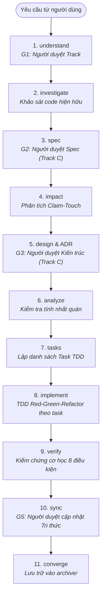

# WORKFLOW.md — Vòng đời Phát triển & Hệ thống Gates

Tài liệu quy định chi tiết về **Vòng đời Phát triển Thay đổi (Change Lifecycle)** và **Hệ thống Cổng kiểm soát (Gates)** của Forge.

Mọi giai đoạn dưới đây đều là một node trong đồ thị phụ thuộc (Artifact DAG) được khai báo rõ ràng, được kiểm soát bởi các bài kiểm tra cơ học mang tính xác định (exit codes) tại các điểm then chốt, và được điều tiết linh hoạt theo quy mô thông qua Bộ định tuyến 3 Track.

---

## 0. Hai Nguyên tắc Thực thi Cốt lõi

1. **Đồ thị Artifact (DAG) là dữ liệu:**  
   File cấu hình `.forge/schema/<track>.yaml` khai báo các artifact với các trường `id`, `generates`, `requires`, `reads`, `instruction`. Thứ tự thực hiện được tính toán bằng thuật toán đồ thị, không phải nhắc nhở bằng prompt. Trạng thái hoàn thành được phái sinh trực tiếp từ sự tồn tại của tệp trên đĩa — một artifact được coi là hoàn thành khi và chỉ khi tệp khai báo trong `generates` tồn tại. Do đó, không có tệp trạng thái nào có thể bị mất đồng bộ.
2. **Cổng kiểm soát (Gates) là các mã thoát lệnh (Exit Codes):**  
   Một cổng kiểm soát có cấu trúc: `{point, check, blocking, onError}`. Lệnh `forge gate <point>` chạy toàn bộ các phép kiểm tra cơ học đã đăng ký tại điểm đó và trả về mã thoát khác 0 nếu có bất kỳ kiểm tra dạng chặn (blocking) nào thất bại. Quy trình không dựa dẫm vào những câu dặn dò mơ hồ như "AI hãy cẩn thận".

Các điểm đặt cổng (do kernel cố định, `forge gate --help` in danh sách hiện tại): `investigate:pre`, `spec:post`, `impact:post`, `analyze:post`, `implement:pre`, `implement:task:post`, `verify:post`, `sync:pre`, `converge:post`. Không có cổng sau `proposal`, `design` hay `tasks`: các artifact đó do DAG kiểm tra.

---

## 1. Bộ định tuyến 3 Track (Scale Router)

Việc phân loại quy mô diễn ra một lần duy nhất, công khai, ngay khi bắt đầu giai đoạn `understand`. Cơ chế chuyển đổi là **bánh cóc một chiều (one-way ratchet)**: khi phát hiện độ phức tạp tiềm ẩn, hệ thống sẽ nâng cấp Track và ghi nhận lại lý do; tuyệt đối không có cơ chế hạ cấp Track.

| Đặc tính | **Track A — Thăm dò (Probe)** | **Track B — Có giới hạn (Bounded)** | **Track C — Cấu trúc (Structural)** |
|---|---|---|---|
| **Khi nào áp dụng** | Câu hỏi khảo sát, spike nghiên cứu, code thử nghiệm vứt bỏ. "Có khả thi không?", "Thử nghiệm thư viện mới". | Thay đổi có phạm vi rõ ràng trong một luồng **đã tồn tại sẵn** trong repository và không chạm vào bất kỳ claim `ARC-`, `API-`, hay `DAT-` nào. | Xây dựng tính năng/hệ thống con mới; thay đổi ranh giới module, public API, data schema; chạm vào invariant hoặc bảo mật/migration. |
| **Artifacts bắt buộc** | Không có (trả lời trực tiếp trong chat). | `proposal.md`, `spec/` (nếu thay đổi logic), `tasks.md`. | Đầy đủ: `proposal.md`, `spec/`, `impact.md`, `design.md` (ADR), `tasks.md`. |
| **Các giai đoạn chạy** | `understand` ➔ `investigate`. | `understand` ➔ `investigate` ➔ `spec?` ➔ `tasks` ➔ `implement` ➔ `verify` ➔ `sync` ➔ `converge`. | Chạy toàn bộ các giai đoạn từ đầu đến cuối. |
| **Cổng con người duyệt** | G1. | G1, G5. | G1, G2, G3, G5 (và G4/G6 nếu chạm điều kiện dừng). |
| **Ngân sách mặc định** | 15 bước / 10 phút. | 60 bước / 45 phút. | Không giới hạn tổng, áp dụng giới hạn theo từng task nhỏ. |
| **Mã nguồn có giữ lại?** | Không (code nháp bỏ đi). | Có. | Có. |

### Các điều kiện tự động nâng cấp Track
Lệnh `forge track check` sẽ tự động nâng cấp B ➔ C khi phát hiện:
- Bán kính ảnh hưởng (blast radius) chạm vào bất kỳ Claim loại `ARC-`, `API-`, hoặc `DAT-` nào.
- Thay đổi thêm một public route, public export, hoặc file migration cơ sở dữ liệu.
- Số file nằm trong phạm vi thay đổi vượt quá ngưỡng quy định (mặc định > 15 file).

> **Nguyên tắc chống phản khuôn mẫu:** Ý nghĩ *"Việc này quá đơn giản để cần viết spec"* chính là tín hiệu nhắc nhở cần phải chọn Track nặng hơn. Thứ co giãn theo sự đơn giản là *độ dài của artifact* (một spec delta có thể chỉ dài 5 dòng), tuyệt đối không phải là *sự bỏ qua quy trình*.

---

## 2. Vòng đời Thay đổi Hoàn chỉnh (Lifecycle DAG)



### Hai quyết định thiết kế tinh gọn:
- **Không có file `tests.md` riêng biệt:** Kế hoạch kiểm thử được tích hợp trực tiếp vào kịch bản của spec và chu trình TDD (Red ➔ Green) của từng task trong `implement`. Viết riêng một file mô tả các test chưa tồn tại chỉ là sự lãng phí tài nguyên.
- **Không có file `verification.md` viết tay:** Báo cáo nghiệm thu được máy tự động sinh ra dưới dạng `verification.json` dựa trên bằng chứng thực tế từ test runner và linter. Việc viết tay báo cáo nghiệm thu là kẽ hở để người ta tùy tiện ghi "mọi thứ đã pass" mà không thực sự chạy kiểm chứng.

---

## 3. Chi tiết Từng Giai đoạn (Phase Reference)

### 3.1 `understand` (Thấu hiểu & Định tuyến)
- **Mục đích:** Phát biểu lại yêu cầu bằng ngôn ngữ rõ ràng, chọn Track phù hợp, và liệt kê các giả định chưa rõ. Tuyệt đối chưa sửa code hay lập kế hoạch chi tiết.
- **Cổng con người duyệt (G1):** Người dùng xác nhận lại ý định và Track đã chọn.
- **Lệnh CLI:** `forge change new "<tên>" --track <A|B|C>`

### 3.2 `investigate` (Điều tra Hiện trạng)
- **Mục đích:** Đọc hiểu code hiện có trước khi sửa đổi. Xác định các quy tắc ngầm, hàm liên quan và các candidate claim.
- **Nguyên tắc:** Điều tra nguyên nhân gốc rễ trước khi nghĩ đến giải pháp.
- **Lệnh CLI:** `forge instructions investigate --change <N>`

### 3.3 `spec` (Đặc tả Delta Requirements)
- **Mục đích:** Chuyển đổi ý định thành các yêu cầu logic (`REQ-xxx`) và các kịch bản kiểm thử (`SCN-xxx`).
- **Đầu ra:** Thư mục `changes/NNNN/spec/*.md`.
- **Cổng kiểm soát:** `forge gate spec:post --change <N>` (Kiểm tra ngữ pháp đặc tả, bắt buộc mọi yêu cầu phải có mã ID và kịch bản đi kèm).
- **Cổng con người duyệt (G2):** Người dùng duyệt đặc tả trước khi đi tiếp (đối với Track C).

### 3.4 `impact` (Phân tích Bán kính Ảnh hưởng & Claim-Touch)
- **Mục đích:** Sử dụng đồ thị phụ thuộc và cấu trúc code để tính toán chính xác những file và Claim nào bị ảnh hưởng.
- **Đầu ra:** File `changes/NNNN/impact.md`.
- **Cổng kiểm soát:** `forge gate impact:post --change <N>` (Thực thi **Quy tắc Claim-Touch**: Mọi Claim có anchor giao cắt với git diff đều bắt buộc phải được giải trình là `Unaffected`, `Updated`, hay `Superseded`).

### 3.5 `design` (Thiết kế & Quyết định Kiến trúc)
- **Mục đích:** Chọn giải pháp kỹ thuật, cân nhắc các phương án đánh đổi, và soạn thảo Quyết định Kiến trúc (ADR) nếu có thay đổi mang tính cấu trúc.
- **Đầu ra:** `changes/NNNN/design.md` và file ADR trong `docs/system/decisions/`.
- **Cổng con người duyệt (G3):** Người dùng duyệt thiết kế kiến trúc và ADR.

### 3.6 `analyze` (Kiểm định Nhất quán)
- **Mục đích:** Chạy kiểm tra tĩnh toàn diện mà không sửa đổi file nào: đảm bảo mọi Requirement trong Spec đều có giải pháp thiết kế tương ứng.
- **Cổng kiểm soát:** `forge gate analyze:post --change <N>`

### 3.7 `tasks` (Lập Kế hoạch Nhiệm vụ TDD)
- **Mục đích:** Phân rã thiết kế thành danh sách các task nhỏ, có thể kiểm thử độc lập, mỗi task bắt buộc phải gắn thẻ mã Requirement mà nó giải quyết (`[REQ-xxx]`).
- **Đầu ra:** `changes/NNNN/tasks.md`.
- **Cổng kiểm soát:** `forge gate analyze:post --change <N>` (mọi Requirement đều có task tương ứng)

### 3.8 `implement` (Triển khai theo chuẩn TDD)
- **Mục đích:** Thực thi từng task một cách kỷ luật theo đúng chu trình:
  1. **ĐỎ (Red):** Viết bài kiểm thử trước, chạy thử để chứng kiến bài test thất bại thực sự.
  2. **XANH (Green):** Viết lượng code tối thiểu để bài test vượt qua.
  3. **REFACTOR:** Tối ưu hóa code cho sạch đẹp.
- **Ranh giới:** AI chỉ được phép sửa đổi trong phạm vi file đã khai báo cho task đó.

### 3.9 `verify` (Kiểm chứng Cơ học Toàn diện)
- **Mục đích:** Nghiệm thu chất lượng độc lập bằng máy móc trước khi cho phép hợp nhất code.
- **Lệnh CLI:** `forge verify --change <N>`
- **8 Điều kiện kiểm chứng bắt buộc:**
  1. Toàn bộ test suite của dự án phải PASS (không có test lỗi).
  2. Không có bài test nào bị âm thầm skip bất thường.
  3. 100% các Requirement trong spec đều được đánh dấu hoàn thành trong tasks.
  4. Tuân thủ tuyệt đối quy tắc Claim-Touch (không bỏ sót claim nào bị sửa).
  5. Tầng phái sinh (derived tier) không bị lỗi thời.
  6. Không còn lỗi lint hay lỗi typecheck.
  7. Không vi phạm các quy tắc kiến trúc trong `.forge/config.yaml`.
  8. Git working tree sạch sẽ, các file mới đều đã được commit.
- **Đầu ra:** File `changes/NNNN/verification.json` mang chữ ký dữ liệu cơ học.

### 3.10 `sync` (Đồng bộ Tri thức Hệ thống)
- **Mục đích:** Gập (fold) các đặc tả delta trong change vào tài liệu năng lực vĩnh viễn của hệ thống tại `docs/system/`, cập nhật commit hash cho các anchor, và xử lý các mục trong sổ cái độ lệch.
- **Cổng con người duyệt (G5):** Người dùng xác nhận việc cập nhật tri thức vĩnh viễn.

### 3.11 `converge` (Lưu trữ Hoàn tất)
- **Mục đích:** Di chuyển thư mục `changes/NNNN/` vào `changes/archive/` ở trạng thái chỉ-đọc.
- **Lệnh CLI:** `forge archive --change <N>`

---

## 4. Hệ thống Cổng Phê duyệt của Con người (Human Gates)

Forge thiết kế số lượng cổng con người duyệt ở mức tối thiểu cần thiết để không làm đình trệ công việc nhưng vẫn giữ được quyền kiểm soát chiến lược:

| Cổng | Tên cổng | Giai đoạn | Thẩm quyền của con người |
|:---:|---|---|---|
| **G1** | Phê duyệt Ý định & Track | `understand` | Xác nhận mục tiêu nghiệp vụ và quy mô Track (A/B/C) |
| **G2** | Phê duyệt Đặc tả | `spec` | Xác nhận các yêu cầu delta và kịch bản kiểm thử (Track C) |
| **G3** | Phê duyệt Kiến trúc | `design` | Phê duyệt phương án thiết kế và các quyết định ADR (Track C) |
| **G4** | Dừng khẩn cấp: Di chuyển dữ liệu | `tasks` / `implement` | Kích hoạt khi có migration dữ liệu có tính hủy diệt |
| **G5** | Phê duyệt Tri thức Vĩnh viễn | `sync` | Xác nhận việc cập nhật vào kho tri thức `docs/system/` |
| **G6** | Dừng khẩn cấp: Rủi ro bảo mật | Mọi lúc | Kích hoạt khi thay đổi chạm vào chứng thực, phân quyền hoặc khóa bí mật |

---

## 5. Cấu hình Tự động hóa (Autonomy Settings)

Trong file `.forge/config.yaml`, người dùng có thể cấu hình mức độ tự động hóa cho các cổng G2, G3, G5 tùy theo độ tin cậy mong muốn:

```yaml
autonomy:
  G2: review      # 'review' (con người duyệt) hoặc 'auto' (tự động đi tiếp nếu gate exit 0)
  G3: review
  G5: review
```
*Lưu ý: Cổng G1 (chọn Track ban đầu), G4 (nguy cơ mất dữ liệu) và G6 (rủi ro bảo mật) là **bất biến** và không bao giờ có thể chuyển sang chế độ tự động.*
